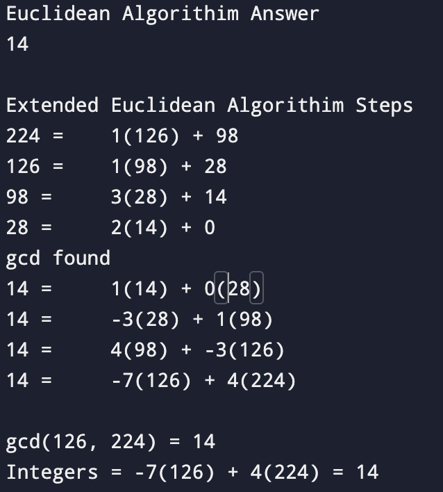

# Euclidean Algorithm in Rust

This repository contains an archive of an implementation of the GCD function
using rust and the Extended Euclidean algorithm. 

## Example Output

Here’s a visual representation of the ouput of the algorithim:

## References
Mathematical Thinking: Problem-Solving and Proofs, 2nd edition, by D’Angelo and West.

